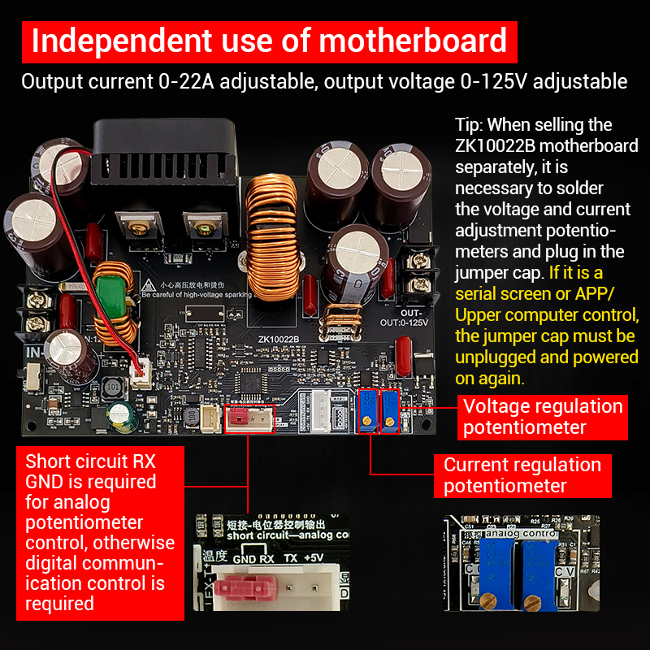

## Python script to control Wuzhi Power ZK-10022 step-down converters

This is a bare-bones Python script to interface a **Wuzhi Power ZK-10022** (aka ZK10022 aka ZK-10022B) CNC step-down converter via the ZK-BT bluetooth adapter. Tested on Linux.

### Usage

```
usage: wuzhi.py [-h] [-m MAC] [-s] [-l] [-0] [-1] [-v VOLT] [-a AMPS] [-b BACKLIGHT] [-z BUZZER] [-t TIMEOUT] [-r] [-c] [-d]

options:
  -h, --help            show this help message and exit
  -m MAC, --mac MAC     MAC address
  -s, --status          show status
  -l, --limits          show limits
  -0, --off             turn output off
  -1, --on              turn output on
  -v VOLT, --volt VOLT  set output voltage
  -a AMPS, --amps AMPS  set output current
  -b BACKLIGHT, --backlight BACKLIGHT
                        set backlight
  -z BUZZER, --buzzer BUZZER
                        set buzzer
  -t TIMEOUT, --timeout TIMEOUT
                        set timeout
  -r, --restart         restart PSU
  -c, --cron            do the cron job
  -d, --debug           show me the money
```

### Examples

```
# ./wuzhi.py --on --volt 10 --amps 5
Switching output on
Result: 0106 | 00 | 1200 01
Setting voltage to 10.0V (03e8)
Result: 0106 | 00 | 0003 e8
Setting amps to 5.0A (01f4)
Result: 0106 | 00 | 0101 f4

# ./wuzhi.py --status
{
    "Status": {
        "volt_in": 39.88,
        "volt_set": 10.0,
        "amps_set": 5.0,
        "volt_out": 8.81,
        "amps_out": 5.0,
        "w_out": 44.0,
        "ah_out": 0.015,
        "wh_out": 0.101,
        "on_time_h": 0,
        "on_time_m": 0,
        "on_time_s": 12,
        "s_temp": 25.3,
        "p_temp": 0.0,
        "keylock": 0,
        "protection": 0,
        "outstate": 1,
        "powerbtn": 1,
        "reserved": 0,
        "backlight": 3,
        "timeout": 1,
        "product": 10022
    }
}

# ./wuzhi.py --off
Switching output off
Result: 0106 | 00 | 1200 00

# ./wuzhi.py --status --debug
11:38:08.395 INFO    [wuzhi.py:68 ] Connecting...
11:38:10.242 INFO    [wuzhi.py:72 ] Connected to FB:5E:94:63:70:0C
11:38:10.299 INFO    [wuzhi.py:157] Command 01030000001e, sending: 01030000001ec5c2
11:38:10.361 INFO    [wuzhi.py:81 ] Callback: 0103 | 3c | 03e8 01f4 0000 0000 0000 105c 0018 0000 00af 0000 0000 0000 0012 00ff 0000 0000 0000 0000 0000 0000 0003 0001 2726 0064 0001 0006 0000 0000 0000 0000 b7c0
11:38:10.361 INFO    [wuzhi.py:88 ] CRC match: b7c0
11:38:10.361 INFO    [wuzhi.py:95 ] Is a 'settings' reply
11:38:10.361 WARNING [wuzhi.py:219] {
    "Status": {
        "volt_in": 41.88,
        "volt_set": 10.0,
        "amps_set": 5.0,
        "volt_out": 0.0,
        "amps_out": 0.0,
        "w_out": 0.0,
        "ah_out": 0.024,
        "wh_out": 0.175,
        "on_time_h": 0,
        "on_time_m": 0,
        "on_time_s": 18,
        "s_temp": 25.5,
        "p_temp": 0.0,
        "keylock": 0,
        "protection": 0,
        "outstate": 0,
        "powerbtn": 0,
        "reserved": 0,
        "backlight": 3,
        "timeout": 1,
        "product": 10022
    }
}
```

### Hardware specs

The **Wuzhi Power ZK-10022** is a CNC step-down DC adjustable regulated power supply. It is designed
for applications requiring stable constant voltage and constant current, such as CNC machinery and
other electronic projects. Some versions come with a color screen for easy voltage/current monitoring
and control. This model is popular among users who need a compact, high-power, adjustable DC power
supply module for CNC and laboratory use.

* Input voltage: **12-140V DC**
* Output voltage: **0-125V DC adjustable**
* Output current: **0-22A**
* Output power: **up to 1500W**
* CV and CC operation

### Where to buy the hardware

* https://fr.aliexpress.com/item/1005006946184825.html

### Images

<div style="text-align:center;">
   <br>
   <br>
   
</div>


